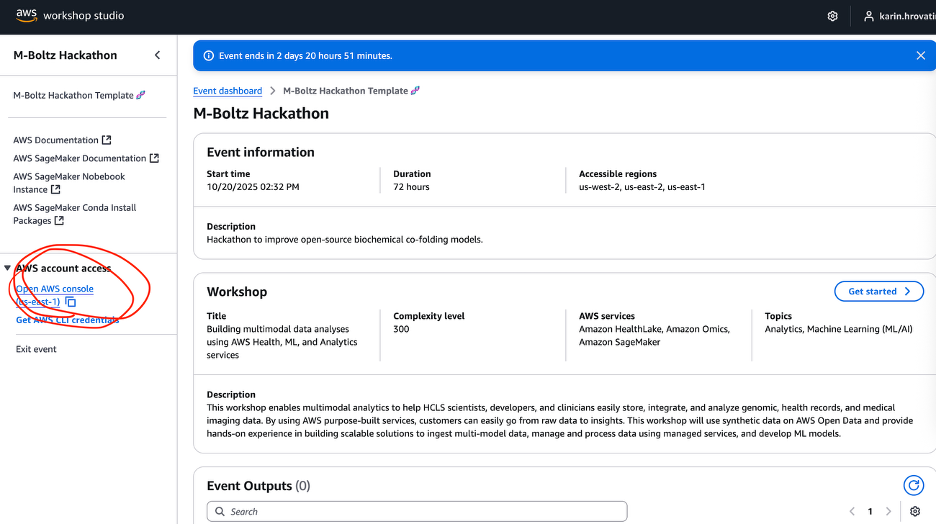
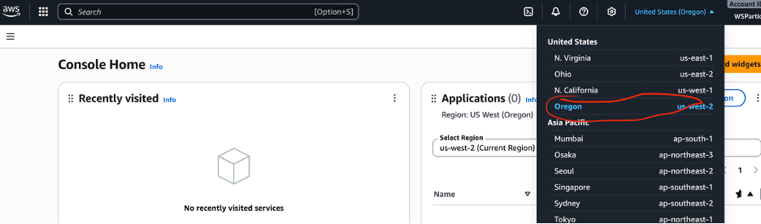

# How-to AWS for hackathon

How-to AWS resources for hackathon:
1.	Get account: https://tinyurl.com/mboltzaws 
    a.	Use one-time passcode
    b.	Use AWS console (top left of GUI)
Open it via this button:

 
2.	Setting regions: see this thread https://boltz-community.slack.com/archives/C09LQG2HNBA/p1760970261463439 

 
3.	Create notebook instance from GitHub repo: https://us-west-2.console.aws.amazon.com/sagemaker/home?region=us-west-2#/notebooks-and-git-repos

## Troubleshooting

### Download data

To download the challenges dataset via terminal, first navigate to the folder SageMaker/boltz-hackathon-template/ before running the download command (e.g., wget).
Managing environment: https://docs.aws.amazon.com/sagemaker/latest/dg/studio-lab-use-manage.html 

### Managing environments

See the [general guide](https://docs.aws.amazon.com/sagemaker/latest/dg/studio-lab-use-manage.html).

#### Create conda env

1. Open terminal (e.g. via Jupyter Lab)

2. Start bash shell via `bash`

3. Use conda as available there
