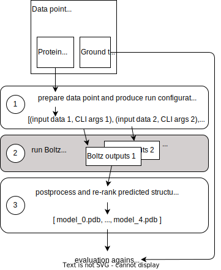
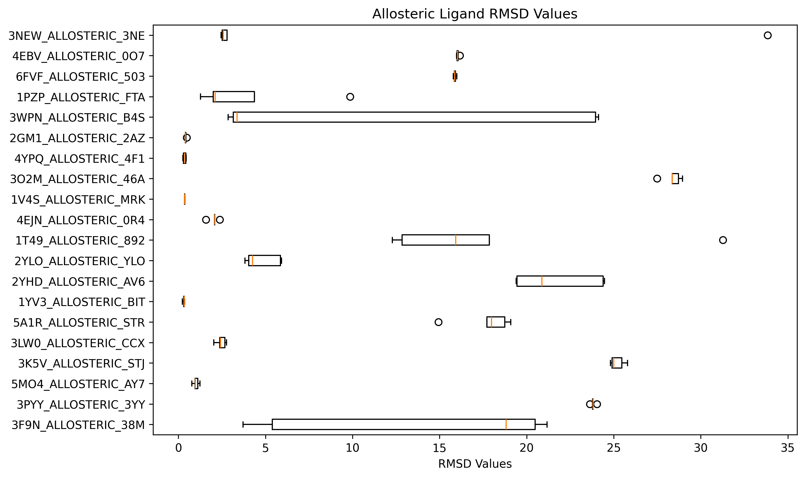
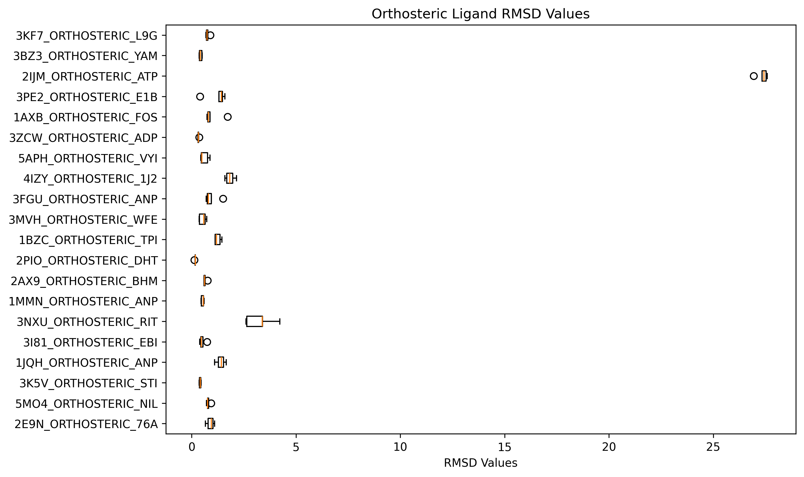

# M-Boltz Hackathon Template 🧬

Welcome to the M-Boltz hackathon!
It is great to have you here!

This repository is a fork of the [Boltz](https://github.com/jwohlwend/boltz) repository and has been modified for the M-Boltz hackathon to allow a straightforward evaluation of your contributions for the antibody-antigen complex prediction challenge and the allosteric-orthosteric ligand challenge.

Please read these instructions carefully before you start.

## Setup ⚙️

First, create a fork of the template repository!

Different from the original installation instructions, please set up your environment by first using `conda` or `mamba` to create the environment and then use `pip` to install the `boltz` package.

```
git clone YOUR_FORKED_REPO_URL
cd <name_of_your_fork>
conda env create -f environment.yml --name boltz
conda activate boltz
pip install -e ".[cuda]"
```

**_NOTE:_** The hackathon requires at least one CUDA-enabled GPU for running inference. CPU-only installations are not supported for this hackathon, use at your own risk.

## Download the datasets 📥

Please download the data for both challenges from the links below and place them in the `hackathon_data` folder.
The data includes the actual datasets, pre-computed MSAs, example predictions and evaluations.

```
wget https://d2v9mdonbgo0hk.cloudfront.net/hackathon_data.tar.gz
mkdir hackathon_data
tar -xvf hackathon_data.tar.gz -C hackathon_data
```

## Quick Start ⚡️

To participate in the hackathon:

1. **Modify the code**: Edit the functions in `hackathon/predict_hackathon.py`:
   - `prepare_protein_complex()` or `prepare_protein_ligand()` - Customize input configurations and CLI arguments
   - `post_process_protein_complex()` or `post_process_protein_ligand()` - Re-rank or post-process predictions
   - You can also modify any Boltz source code in `src/boltz/` as needed

   These functions already contain some minimal code such that the next scripts can be successfully executed.
   We explain the functions in more detail below.

2. **Run predictions**: Execute the prediction script on a validation dataset:
   ```bash
    python hackathon/predict_hackathon.py \
        --input-jsonl hackathon_data/datasets/abag_public/abag_public.jsonl \
        --msa-dir hackathon_data/datasets/abag_public/msa/ \
        --submission-dir ./my_predictions \
        --intermediate-dir ./tmp/ \
        --result-folder ./my_results
   ```

  - `--input-jsonl` provides information about task type, input molecules, and ground truth for evaluation
  - `--msa-dir` contains the pre-computed MSA
  - `--submission-dir` is the output directory for the predicted structures
  - `--intermediate-dir` is directory for temporary files (input YAMLs, Boltz outputs, etc.)
  - `--result-folder` is the output directory for the evaluation results (metrics)

   **_NOTE:_** If this is your first time using `boltz`, some files (model weights, CCD library) will get downloaded to your machine first. This can take a while and should *not* be interrupted to not corrupt the files. So take the chance, grab a coffee, and talk to some other participants!

3. **Evaluate**: Results will be automatically computed and saved to the `--result-folder` directory. 
Review the metrics to assess your improvements.

4. **Iterate**: Refine your approach based on evaluation results and repeat!

5. **Submit**: Before the deadline, push your final code to your forked repository and fill out the [submission form](https://forms.office.com/Pages/ResponsePage.aspx?id=Wft223ejIEG8VFnerX05yXDK4yzHF_lJvVLbJHaHqwFUN0NZMk4xTFBSUlNWTlkzNUhDS1pBUlVHViQlQCN0PWcu).

## Entrypoints for Participants 💻

The following workflow is relevant for both challenges. We provide some dedicated explanation only relevant for the Allosteric-orthosteric ligand prediction challenge down below.

### `hackathon/predict_hackathon.py`

We will evaluate your contributions by calling `hackathon/predict_hackathon.py` (see example above). This script performs the following main steps for each data point (e.g., protein complex) of a dataset (defined in`--input-jsonl`): 

1. Generate one or multiple combinations of Boltz input YAML file (protein and molecule input data) and Boltz CLI arguments

2. Call Boltz with each specified combination of YAML file and CLI arguments

3. Post-process and rank the predictions from all combinations and store top 5 predictions in the submission directory

You can modify steps 1 and 3 by editing the functions in `hackathon/predict_hackathon.py`.



#### Modifying step 1: Generating input YAML files and CLI arguments

To adapt step 1 modify the following function for the antibody-antigen complex prediction challenge (the allosteric-orthosteric ligand prediction challenge is similar):

`def prepare_protein_complex(datapoint_id: str, proteins: list[Protein], input_dict: dict, msa_dir: Optional[Path] = None) -> list[tuple[dict, list[str]]]:`

This function enables modification of [Boltz inputs](https://github.com/jwohlwend/boltz/tree/main?tab=readme-ov-file#inference) - the YAML file with molecular information (e.g., proteins, ligands, constraints, etc.) and CLI arguments (e.g., the number of diffusion samples or recycling steps).

This function gets as input:

- `datapoint_id: str`: The ID of the current datapoint
- `proteins: list[Protein]`: A list of `Protein` objects to be processed (defined in `hackathon_api.Protein`)
- `input_dict: dict`: A pre-filled dictionary with minimal input data for that data point
- `msa_dir: Path`: The directory with the precomputed MSA files. MSA files are always provided.

For example input information see `hackathon_data/datasets/abag_public/abag_public.jsonl`. This information will be automatically converted to the above-specified objects.

Each protein has attributes 

- `id: str`: The chain ID of the protein
- `sequence: str`: The amino acid sequence of the protein
- `msa: str`: The name of the MSA file within `msa_dir`. We always provide a precomputed MSA.

Each data point contains three proteins with IDs: `"H"` (heavy chain segment), `"L"` (light chain segment), and `"A"` (antigen).

The `input_dict` has the `sequences` field already filled with `protein` or `ligand` entries for each molecule in the datapoint. 
A `protein` entry already has the `id`, `sequence`, and `msa` fields filled. 
A `ligand` entry has the `id` and `smiles` fields filled. 
Inside this function you can copy and modify `input_dict` as needed to add or change any other fields supported by the Boltz input YAML format (e.g., constraints, hyperparameters, etc.).

The function should return a **list of tuples**, where each tuple contains:

- A modified `input_dict` with any changes made during preparation, which will be reflected in the Boltz input YAML.
- A list of CLI arguments that should be passed to Boltz for this configuration.

By returning multiple tuples, you can run Boltz with different configurations for the same datapoint (e.g., different sampling strategies, different constraints, different hyperparameters). 
Each configuration will be run separately with its own YAML file and CLI argument combination.

**_NOTE_**: Your CLI arguments will be appended to a list of default arguments: 

- `--devices 1`
- `--cache` (use `BOLTZ_CACHE` environment variable to adapt cache location)
- `--output-dir` (based on `--intermediate-dir` argument of `predict_hackathon.py`)
- `--no-kernels` (to disable custom CUDA kernels for compatibility)
- `--output-format pdb` (to always output PDB files)

We have already precomputed MSAs for all proteins and they will be input alongside the protein sequences. Thus, you can not change the MSA calculation. However, you can post-process the input MSA within the `prepare_protein_complex` function before it is passed to the Boltz model, e.g. save a sub-sampled MSA to a *new* CSV file and ajust the MSA path of the protein in `input_dict` accordingly. You can find example MSA in the provided data.

#### Step 2: Running Boltz

With the provided information, the script will then call Boltz once for each configuration. 

You are also welcome to make modifications to the Boltz code as needed.

#### Modifying step 3: Post-processing and ranking predictions

Afterwards, the following function gets called:

`def post_process_protein_complex(datapoint: Datapoint, input_dicts: list[dict[str, Any]], cli_args_list: list[list[str]], prediction_dirs: list[Path]) -> list[Path]:` 

This function enables modification, combining, or re-rank of predicted structures from multiple configurations. It outputs paths for multiple structure candidates for each data point.

This function receives:
- `datapoint: Datapoint`: The original datapoint object (defined in `hackathon_api.Datapoint`)
- `input_dicts: list[dict[str, Any]]`: A list of input dictionaries used (one per configuration)
- `cli_args_list: list[list[str]]`: A list of CLI arguments used (one per configuration)
- `prediction_dirs: list[Path]`: A list of directories containing prediction results (one per configuration)

The function should return a list of **Path objects** pointing to the PDB files of the final structure candidates.
The order is important!
The first path will be your top 1 prediction, and we will evaluate up to 5 predictions for each data point.

### Allosteric-orthosteric ligand prediction challenge

For the allosteric-orthosteric ligand challenge, there are similar functions as for antibody-antigen complex challenge explained above. Here are summarized only parts of code that differ between the two challenges, so please first read the above explanations.

`def prepare_protein_ligand(datapoint_id: str, protein: Protein, ligands: list[SmallMolecule], input_dict: dict, msa_dir: Optional[Path] = None) -> list[tuple[dict, list[str]]]:`

Here, `protein` is a single protein object and `ligands` is a list containing a single small molecule object (defined in `hackathon_api.SmallMolecule`). 

**_NOTE_**: We initially thought of allowing multiple ligands, but for this challenge we will only have a single ligand per data point.

For example input information see `hackathon_data/datasets/asos_public/asos_public.jsonl`.

The small molecule has attributes:
- `id`: The ID of the small molecule
- `smiles`: The SMILES string of the small molecule

This function also returns a **list of tuples** to support multiple configurations per datapoint.

For post-processing and re-ranking, use the function

`def post_process_protein_ligand(datapoint: Datapoint, input_dicts: list[dict[str, Any]], cli_args_list: list[list[str]], prediction_dirs: list[Path]) -> list[Path]:`

This function receives lists of configurations and returns a list of **Path objects** pointing to the ranked PDB files.

### Dependencies

Add any additional Python packages to `pyproject.toml` under the `[project.dependencies]` section.
If you need non-Python dependencies, you can add those in `environment.yml`.
We strongly advice against adding non-Python dependencies that are not available through any public conda channel.
If you still want to add them, please install them directly in your machine and make sure that you modify `Dockerfile` accordingly.

## Evaluation Limits ⏱️

When evaluating your contributions your code will run in an environment with the following hardware specs:

- 1x NVIDIA L40 GPU (48GB)
- 32 CPU cores
- 300 GB RAM

Evaluation on either the full antibody-antigen complex test set or the full allosteric-orthosteric ligand test set must complete within **24 hours**.

As a reference, predicting the full internal test set for the antibody-antigen complex challenge (50 data points) with Boltz-2 settings as in this template repo takes around 80 minutes end-to-end on that kind of hardware. 
That means you can roughly spend 18 times more compute budget than Boltz-2 default settings if you want to process the full test set within 24 hours, but we advise to leave some buffer.

Predicting the full internal test set for the allosteric-orthosteric ligand challenge (44 data points) with Boltz-2 settings as in this template repo takes around 60 minutes end-to-end on our hardware.
That means you can roughly spend 24 times more compute budget than Boltz-2 default settings if you want to process the full test set within 24 hours, but we advise to leave some buffer.

To protect our proprietary data and ensure a fair competition, the evaluation environment will have **no internet access**.

If your workflow creates additional temporary files, please make sure to place them into the `--intermediate-dir` folder.

## Validation Sets 🧪

For both challenges we provide a validation data set that you can use to test your contributions and track your progress.

### Antibody-Antigen Complex Prediction Challenge

The validation set for the antibody-antigen complex challenge comprises of 10 public PDB structures, all released after the cut-off date for Boltz training data.

To run the prediction and evaluation, use:

```bash
python hackathon/predict_hackathon.py \
    --input-jsonl hackathon_data/datasets/abag_public/abag_public.jsonl \
    --msa-dir hackathon_data/datasets/abag_public/msa/ \
    --submission-dir <SUBMISSION_DIR> \
    --intermediate-dir ./tmp/ \
    --result-folder <RESULT_DIR>
```

Replace `<SUBMISSION_DIR>` with the path to a directory where you want to store your structure predictions and `<RESULT_DIR>` with the path to a directory where you want to store the evaluation results.
If you do not provide `--result-folder`, the script will only run the predictions and not the evaluation.

If you just want to run the evaluation on already existing predictions:

```bash
python hackathon/evaluate_abag.py \
    --dataset-file hackathon_data/datasets/abag_public/abag_public.jsonl \
    --submission-folder SUBMISSION_DIR \
    --result-folder ./abag_public_evaluation/
```

The evaluation script will compute the Capri-Q docking assessment classification scores (high, medium, acceptable, incorrect, error) for each of your top 5 predictions per data point.
Error means that the prediction or evaluation did not finish due to a programmatic error.
It will then print the distribution of classifications for the top 1 predictions across all data points.
Additionally, it will compute the number of "successful" predictions, i.e., the number of data points for which the top 1 prediction is classified as "acceptable" or better.
You will find more stats in a file `combined_results.csv` in the result folder.

On the validation set, Boltz-2 with default settings should give you the following distribution of classifications for the top 1 predictions:

- High: 2/10
- Medium: 0/10
- Acceptable: 0/10
- Incorrect: 8/10

The winner of this challenge will be the team with the highest number of successful top 1 predictions on our *internal* test set. 
Ties are broken by looking at the number of predictions with “high” classification, then with “medium” classification and finally with “acceptable” classification.

### Allosteric-Orthosteric Ligand Prediction Challenge

The validation set for the allosteric-orthosteric ligand challenge comprises of 40 structures that were also used in the recent paper of Nittinger et. al [1].

To run the prediction and evaluation, use:

```bash
python hackathon/predict_hackathon.py \
    --input-jsonl hackathon_data/datasets/asos_public/asos_public.jsonl \
    --msa-dir hackathon_data/datasets/asos_public/msa/ \
    --submission-dir <SUBMISSION_DIR> \
    --intermediate-dir ./tmp/ \
    --result-folder <RESULT_DIR>
```

Replace `<SUBMISSION_DIR>` with the path to a directory where you want to store your predictions and `<RESULT_DIR>` with the path to a directory where you want to store the evaluation results.
If you do not provide `--result-folder`, the script will only run the predictions and not the evaluation.

If you just want to run the evaluation on already existing predictions:

```bash
python hackathon/evaluate_asos.py \
    --dataset-file hackathon_data/datasets/asos_public/asos_public.jsonl \
    --submission-folder SUBMISSION_DIR \
    --result-folder ./asos_public_evaluation/
```

The evaluation script will compute the ligand RMSD for each of your top 5 predictions per data point and print the mean of the top 1 RMSDs across all data points, just the allosteric data points, and just the orthosteric data points.
Additionally, it will compute the mean of the minimum RMSDs in the top 5 predictions and the number of data points with minimum RMSD < 2Å in the top 5 predictions.
You will find more stats in a file `combined_results.csv` in the result folder.

Below you see examples of per-structure RMSD plots that Boltz-2 with default settings should give you, with a mean top-1 RMSD of ~6.26Å on this validation set.




The winner of this challenge will be the team with the lowest mean RMSD of the top 1 predictions on our *internal* test set.

### Public Leaderboard

You can submit your results on the validation sets to a public leaderboard during the hackathon, here: 

https://huggingface.co/spaces/hugging-science/M-Boltz-Hackathon

## Submission Format 📦

If you make deeper changes to the provided code, make sure your final predictions are organized in the following structure:
```
{submission_dir}/
├── {datapoint_id_1}/
│   ├── model_0.pdb
│   ├── model_1.pdb
│   ├── model_2.pdb
│   ├── model_3.pdb
│   └── model_4.pdb
└── {datapoint_id_2}/
    ├── model_0.pdb
    └── ...
```

## Handing In Your Final Submission 🎉

Before the deadline on **21st October 2025, 17:30 CEST / 11:30 EDT**, please submit your final code by pushing to your forked repository on GitHub. 
Then fill out the [submission form](https://forms.office.com/Pages/ResponsePage.aspx?id=Wft223ejIEG8VFnerX05yXDK4yzHF_lJvVLbJHaHqwFUN0NZMk4xTFBSUlNWTlkzNUhDS1pBUlVHViQlQCN0PWcu) and enter

- your group name
- the link to your repository
- the commit SHA you want us to evaluate (if not provided, we will evaluate the latest commit on the `main` branch)
- the challenge you are submitting for (antibody-antigen complex prediction, allosteric-orthosteric ligand prediction)
- link to a short description of your method (e.g., a README file in your repository or a separate document)

If you want to submit for both challenges, please fill out the form twice.
You can use different commit SHAs for each challenge if you want.

Before submitting, we advise you to make sure that the following steps work in your repository:

- check out a fresh clone of your repository
- create the `conda` environment and install the dependencies
- run the prediction and evaluation on the validation set
- check that the submission format is correct
- check that the Docker image builds successfully (run `docker build -t boltz-hackathon .` in the root of your repository)

## Need Help? 🆘

If you are on-site feel free to ask any of the organizers or your fellow participants for help.
If you are joining virtually, please reach out on Slack in the `#m-boltz-hackathon` channel.

## References

1. Nittinger, Eva, et al. "Co-folding, the future of docking – prediction of allosteric and orthosteric ligands." Artificial Intelligence in the Life Sciences, vol. 8, 2025, p. 100136. Elsevier,

**Good luck, have fun! 🚀**
